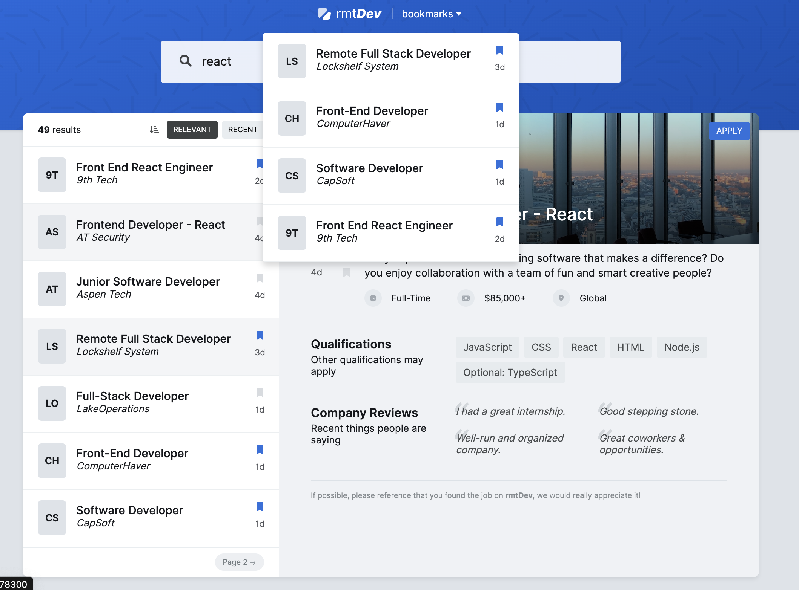

# rmtDev



## Description

This is a React application written in TypeScript. The application provides a job listing interface where users can search for jobs, view job details, and bookmark their favorite jobs.

## Features

- Job Search: Users can search for jobs based on keywords.
- Job Details: Users can view detailed information about a job.
- Bookmark Jobs: Users can bookmark their favorite jobs for later reference.
- Pagination: Users can navigate through the job listings using pagination controls.

## Techniques Used

- React: The application is built using React, a popular JavaScript library for building user interfaces.
- TypeScript: TypeScript, a statically typed superset of JavaScript, is used for writing the application code. This provides enhanced code quality and tooling.
- Context API: React's Context API is used for state management in the application.
- CSS Modules: CSS Modules are used for component-scoped CSS.

## Installation

```bash
git clone <repository-url>
cd <repository-directory>
npm install
```

### Usage

```bash
npm start
```

This will start the application. You can access it at http://localhost:5173.

### Project Structure

The project has the following structure:

`src/components`: This directory contains all the React components used in the application.
`src/contexts`: This directory contains all the React context providers.
`src/lib`: This directory contains utility functions and any other code that doesn't fit into the other categories.

### Contributing

Pull requests are welcome. For major changes, please open an issue first to discuss what you would like to change.

### License
